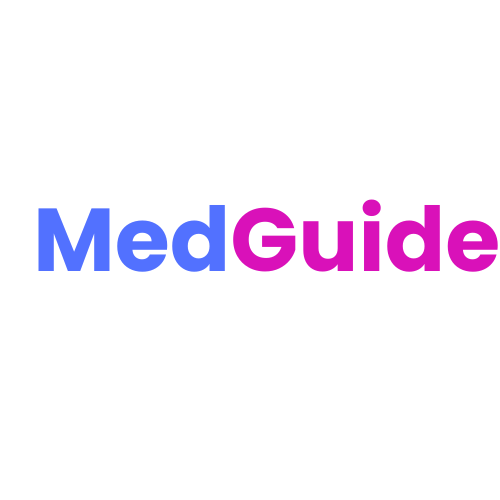

# MedGuide
# 🩺 MedGuide : A Sample Healthcare Utility Application

## Overview
We Are Building A Mobile/Web Software Solution That Leverages Language Localization And Ocr To Simplify Medicine-related Information For Patients. The Project Aligns With The Indiastack Theme Through Future Integration With Health-related Digital Services Like Digilocker And Abha Health Records.

## Social Impact
“Medguide” Empowers Patients In Tier 2/3 Cities And Rural India By Translating Complex Medical Information Into Local Languages. It Promotes Medicine Safety, Reduces Health Risks Due To Misinterpretation, And Supports Elderly And Low-literacy Users. The Solution Bridges The Communication Gap Between Healthcare Systems And Underserved Communities.

## Features

- 📷 OCR & Text Input for Medicine Names
Users can either type or scan a medicine name to get relevant information instantly.

- 🌐 Multi-language Support
Switch between supported languages at runtime. All information is available in multiple Indian vernaculars.

- 🔄 Runtime Language Switching
Users can change the app language without restarting the app. Their preference is saved for future use.

- 💊 Detailed Medicine Info
For 50+ commonly used medicines, the app provides:

Usage instructions

Common side effects

Dosage information

- 🧱 Clean Architecture
Built using best practices in Flutter with separation of concerns:
Presentation → Application → Domain → Data

- 🔁 State Management with BLoC
Efficient state handling for smooth user interactions.

- 📲 User-Friendly UI
Simple, intuitive interface suitable for all age groups.

- 🧪 Easily Extensible
Add more medicines and languages without major refactoring.

## Technology Stack

- Frontend: Flutter (Clean Architecture)
- Ocr Engine: Google_ml_kit(for On Device Text Recognization)
- Localization: Flutter_localization, Easy_localization Or Intl
- Backend: Database , Apis
- Database: Firebase Firestore
- Routing: Go_router
- Ui Design: Material 3 / Cupertino Widgets
- Animations: Flutter_animate

## Problem Statement

In India, A Large Portion Of The Population—especially In Tier 2/3 Cities And Rural Areas—struggles To Understand Medical Prescriptions Due To Language Barriers, Technical Jargon, And Low Health Literacy. Elderly Patients And Non-english Speakers Often Misinterpret Medicine Usage, Dosage, Or Potential Side Effects, Which Can Lead To Serious Health Risks. This Communication Gap Between Patients And Healthcare Professionals Is A Major Challenge In Ensuring Safe And Effective Treatment Adherence. There Is A Clear Need For A Simple, Accessible Tool That Explains Medicine Information In Local Languages To Empower Users And Improve Healthcare Outcomes.

## Brief Description Of Our Idea

- “Medguide” Is A Mobile/Web App That Allows Users To Either Type Or Scan A Medicine Name To Receive Easy-to-understand Explanations In Their Preferred Local Language (Hindi, Tamil, Bengali, Etc.). The App Provides Information Such As The Medicine’s Use, Dosage, And Common Side Effects Using A Hardcoded Database Of 50+ Common Drugs. The Mvp Focuses On Accessibility And User-friendliness, Especially For Elderly Or Non-english-speaking Users. Future Versions Can Integrate With Indiastack Elements Like Digilocker Or Health Id For Prescription Retrieval And Personalized Guidance.

### Thank you 

## Team Name :- AppRush
